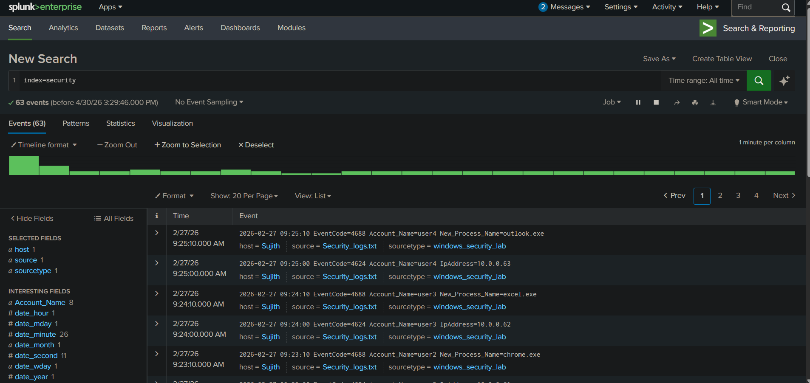
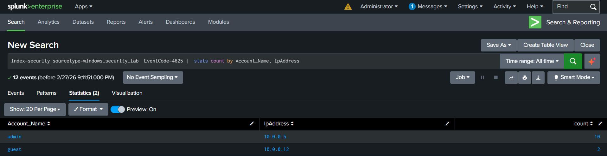
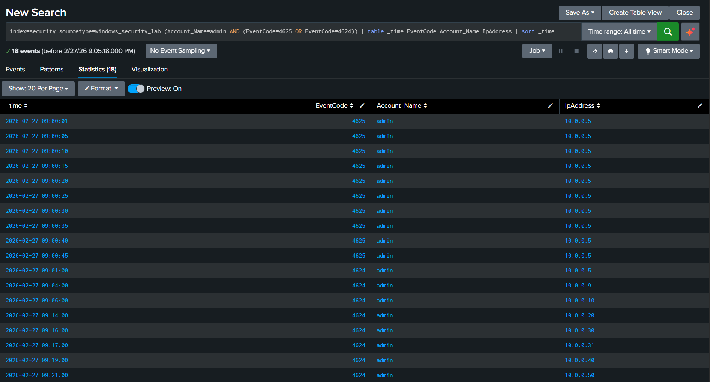
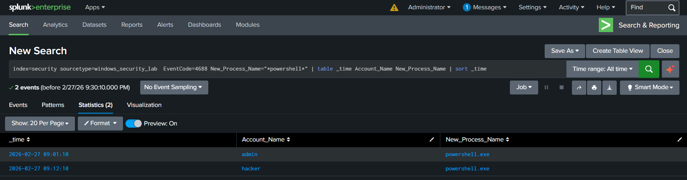
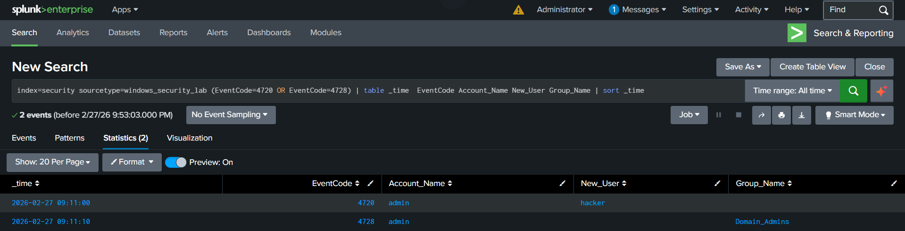
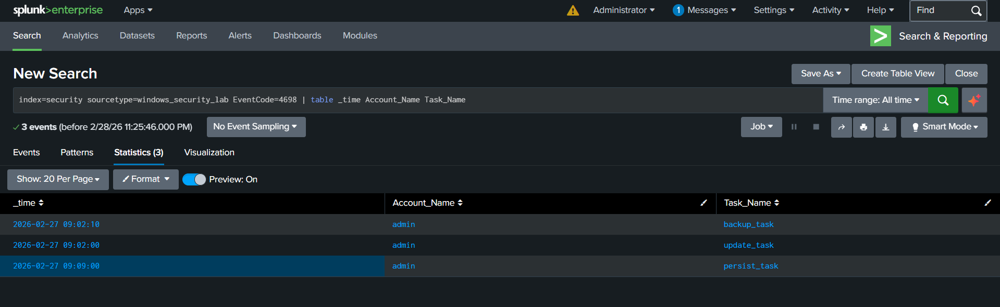
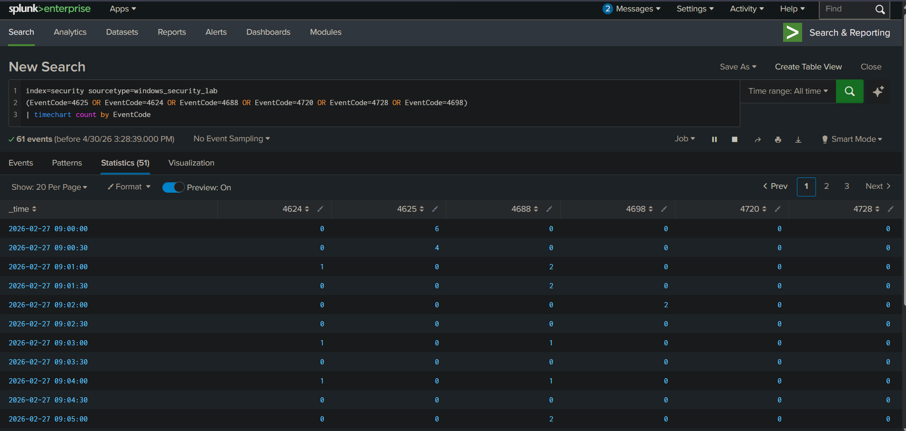
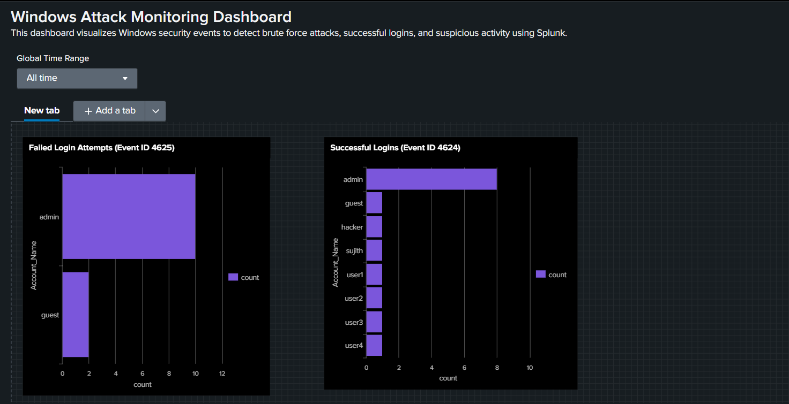
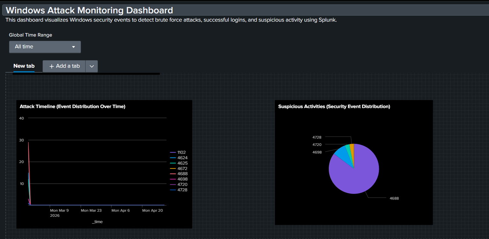

# Multi-Stage Attack Detection using Splunk

## Project Overview
Developed a multi-stage attack detection system using Splunk to identify brute force attacks, privilege escalation, and persistence mechanisms from Windows security logs.

---

## Tools Used
- Splunk Enterprise  
- Windows Security Logs  

---

## Skills Demonstrated
- Log Analysis using Splunk  
- Security Event Monitoring  
- Detection of Brute Force Attacks  
- Privilege Escalation Analysis  
- Persistence Detection  
- Event Correlation and Timeline Analysis  
- Dashboard Creation and Visualization  

---

## Log Analysis and Threat Detection
This project focuses on analyzing Windows security logs to detect and correlate multiple stages of an attack. By monitoring specific Event IDs and patterns, suspicious activities such as repeated failed logins, unauthorized access, privilege escalation, and persistence mechanisms can be identified.

The attack lifecycle is reconstructed by correlating events over time, enabling detection of complex multi-stage attacks and improving incident response capabilities.

---

## Attack Detection Workflow

### 1. Raw Logs Analysis
Initial analysis of ingested Windows security logs.

---

### 2. Failed Login Attempts (Brute Force Detection)
Multiple failed login attempts detected, indicating a brute force attack.

---

### 3. Successful Login Detection
A successful login observed after repeated failed attempts, indicating compromise.

---

### 4. PowerShell Execution Detection
Detection of suspicious command execution activity.

---

### 5. User Creation and Privilege Escalation
A new user account named **'hacker'** was created (Event ID 4720) and added to the **Domain Admins** group (Event ID 4728), granting elevated privileges.

---

### 6. Persistence Mechanism
Scheduled task creation detected, indicating persistence.

---

### 7. Attack Timeline
Visualization of the complete attack sequence over time, showing how different stages of the attack occurred and progressed.

---

## Dashboard Visualization

The dashboard provides a consolidated view of security events, enabling real-time monitoring and quick identification of suspicious activities.

### Dashboard Overview (Part 1)
Displays failed and successful login attempts, helping identify brute force attacks and account compromise.

### Dashboard Overview (Part 2)
Shows attack timeline and distribution of security events, providing insights into attack progression and types of activities performed.

---

## Impact
- Unauthorized access to system accounts  
- Privilege escalation to administrative level  
- Execution of malicious commands  
- Creation of backdoor user accounts  
- Establishment of persistence mechanisms  
- Potential full system compromise  

---

## Mitigation
- Implement strong password policies and account lockout mechanisms  
- Monitor and alert on repeated failed login attempts  
- Restrict PowerShell usage and monitor execution logs  
- Apply least privilege principles to user accounts  
- Monitor creation of new users and changes to privileged groups  
- Regularly review scheduled tasks for suspicious activity  
- Use centralized logging and SIEM tools like Splunk for real-time monitoring  

---

## Conclusion
This project demonstrates detection and analysis of a complete multi-stage attack using Splunk. It highlights the importance of log analysis, event correlation, dashboard visualization, and proactive monitoring in identifying and mitigating security threats.
